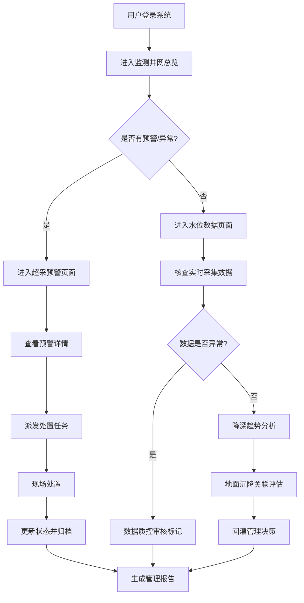

## 1. 产品概述

城市地下水位监测Web系统是面向水务管理部门的专业管理平台，通过对监测井点的实时数据采集、趋势分析和预警管理，实现地下水资源的科学管控与可持续利用。

- **主要目标**：建立覆盖全市的地下水位监测网络，实现水位数据实时采集、降深趋势智能分析、超采预警及时响应、人工回灌科学管理
- **目标用户**：水务局水资源管理处、水文监测站、地下水超采综合治理办公室、相关决策领导
- **核心价值**：提升地下水资源精细化管理水平，防控地面沉降风险，保障城市供水安全和地质环境稳定

## 2. 核心功能

### 2.1 用户角色

| 角色 | 注册方式 | 核心权限 |
|------|----------|----------|
| 系统管理员 | 后台分配 | 用户管理、系统配置、全模块访问 |
| 监测管理员 | 后台分配 | 井点管理、数据审核、设备维护登记 |
| 数据分析员 | 后台分配 | 数据查询、趋势分析、报告生成 |
| 决策领导 | 后台分配 | 仪表盘查看、预警处理、报告审阅 |

### 2.2 功能模块

1. **监测井网页面**：监测井分布图、井点列表、井点详情弹窗、实时状态概览
2. **水位数据页面**：实时水位采集、水位数据表格、水质监测、数据质控、开采量统计
3. **降深趋势页面**：水位降深趋势图、多井点对比分析、季节性变化分析、年度趋势
4. **地面沉降页面**：沉降关联分析、沉降监测点分布、水位-沉降耦合曲线、风险等级评估
5. **超采预警页面**：超采区分布地图、预警等级看板、预警事件列表、预警处置流程
6. **回灌管理页面**：人工回灌登记、回灌井管理、回灌量统计、回灌效果评估
7. **报告生成页面**：年度通报生成、历史数据查询、自定义报表、报告导出

### 2.3 页面详情

| 页面名称 | 模块名称 | 功能描述 |
|----------|----------|----------|
| 监测井网 | 监测井分布地图 | GIS地图展示井点位置、状态标签、类型区分、缩放漫游 |
| 监测井网 | 井点概览统计 | 总井数、在线数、离线数、报警数等关键指标卡片 |
| 监测井网 | 井点列表 | 分页表格、筛选查询、点击查看详情、状态标签 |
| 监测井网 | 井点详情弹窗 | 基本信息、设备信息、最近数据、历史曲线 |
| 水位数据 | 实时采集看板 | 最新水位数据滚动展示、采集时间、采集频率状态 |
| 水位数据 | 水位数据表格 | 多条件筛选、数据导出、异常标注、分页浏览 |
| 水位数据 | 水质监测 | 水质指标展示（pH、TDS、硬度等）、达标情况 |
| 水位数据 | 数据质控 | 异常值标记、缺失率统计、数据审核记录 |
| 水位数据 | 开采量统计 | 区域开采量、单井开采量、同比环比图表 |
| 降深趋势 | 降深趋势图 | 单井/多井时间序列折线图、埋深变化曲线 |
| 降深趋势 | 多井点对比 | 多井降深叠加对比、区域均值对比 |
| 降深趋势 | 季节性分析 | 历年同期对比、枯水期/丰水期分析 |
| 降深趋势 | 年度趋势 | 年均水位变化、多年趋势线、预测曲线 |
| 地面沉降 | 沉降关联分析 | 水位降深与沉降量散点图、相关系数 |
| 地面沉降 | 沉降监测分布 | 沉降监测点GIS分布、沉降速率热力图 |
| 地面沉降 | 耦合曲线 | 水位-沉降时间轴耦合展示 |
| 地面沉降 | 风险评估 | 沉降风险等级分区、预警阈值设置 |
| 超采预警 | 超采区分布 | 超采区GIS边界、超采等级着色、漏斗区展示 |
| 超采预警 | 预警等级看板 | 红/橙/黄/蓝四级预警数量统计、环比变化 |
| 超采预警 | 预警事件列表 | 预警时间、井点、等级、处置状态、责任人 |
| 超采预警 | 预警处置流程 | 确认→派单→处置→复核→归档全流程 |
| 回灌管理 | 回灌登记 | 回灌时间、井号、水量、水源、操作人员登记 |
| 回灌管理 | 回灌井管理 | 回灌井档案、状态管理、维护记录 |
| 回灌管理 | 回灌量统计 | 日/月/年回灌量、区域对比、趋势图 |
| 回灌管理 | 回灌效果评估 | 回灌前后水位恢复曲线、影响半径分析 |
| 报告生成 | 年度通报 | 模板化年度报告、自动填充数据、预览编辑 |
| 报告生成 | 历史数据查询 | 多维度条件组合查询、时间范围、井点选择 |
| 报告生成 | 自定义报表 | 指标选择、图表类型、时间粒度自定义 |
| 报告生成 | 报告导出 | PDF/Excel格式导出、批量下载 |
| 公共模块 | 顶部导航栏 | 系统标题、用户信息、消息通知、全局搜索 |
| 公共模块 | 侧边菜单 | 7个主页面导航、图标+文字、当前页高亮 |
| 公共模块 | 设备维护入口 | 设备维护登记、维护日历、到期提醒 |

## 3. 核心流程

### 3.1 主要用户流程描述

**日常监测流程**：用户登录系统→进入监测井网页面查看全局状态→点击异常井点查看详情→进入水位数据页面核查实时数据→如有异常进入数据质控审核→生成处理记录

**预警处置流程**：系统自动触发超采预警→预警消息推送至相关人员→进入超采预警页面查看预警详情→派发处置任务→现场核查/采取措施→更新处置状态→复核归档

**报告编制流程**：进入报告生成页面→选择报告类型（年度通报/自定义报表）→配置时间范围和数据范围→系统自动生成报表草稿→人工审核修改→导出PDF/Excel分发

### 3.2 Mermaid流程图

## 4. 用户界面设计

### 4.1 设计风格

- **主色调**：深海蓝 #0A2540（专业、稳重、水务行业特征）、辅助色 水蓝 #00B8D9（科技感、水元素）
- **强调色**：预警红 #FF3B30、预警橙 #FF9500、预警黄 #FFCC00、正常绿 #34C759
- **背景色**：页面背景 #F5F7FA、卡片背景 #FFFFFF、侧边栏 #0F172A
- **字体**：标题使用 Noto Serif SC（思源宋体，稳重专业），正文使用 Noto Sans SC（思源黑体，清晰易读）
- **布局**：左侧固定导航栏 + 顶部状态栏 + 主内容区，卡片式布局，大量使用数据可视化图表
- **按钮样式**：圆角6px，主按钮渐变填充，悬停有轻微上浮效果和阴影变化
- **图标风格**：线性图标，统一2px线宽，使用水利相关符号（水滴、波纹、井架等）

### 4.2 页面设计概览

| 页面名称 | 模块名称 | UI元素 |
|----------|----------|--------|
| 监测井网 | 顶部统计卡 | 渐变背景数字卡片、状态图标、趋势小箭头、悬停上浮动画 |
| 监测井网 | GIS地图 | 深浅渐变蓝色底图、井点圆形标记按状态着色、点击波纹动画、缩放控件 |
| 监测井网 | 井点列表 | 斑马纹表格、状态标签胶囊样式、行悬停高亮、分页器圆角 |
| 水位数据 | 实时看板 | 模拟仪表盘样式、数字跳动动画、水位标尺视觉化 |
| 水位数据 | 数据表格 | 异常行红色边框闪烁标记、可展开子行、列排序箭头 |
| 水位数据 | 质控面板 | 通过率环形进度图、异常类型分布饼图、时间轴审核记录 |
| 降深趋势 | 趋势图表 | ECharts面积图、渐变填充、标记线阈值、图例可切换 |
| 降深趋势 | 分析卡片 | 对比数据卡片组、正负值红绿区分、百分比变化徽章 |
| 地面沉降 | 关联散点图 | 气泡图按风险等级着色、回归线虚线、置信区间淡色填充 |
| 地面沉降 | 沉降热力 | GIS热力图层、颜色渐变从绿到红、动画闪烁高风险区 |
| 超采预警 | 等级看板 | 四级预警卡片、对应颜色发光边框、脉冲动画提示 |
| 超采预警 | 事件列表 | 时间轴布局、处置进度条、优先级标签 |
| 回灌管理 | 登记表单 | 分步表单、步骤指示器、表单验证即时反馈 |
| 回灌管理 | 效果评估 | 前后对比瀑布图、恢复曲线双轴图表 |
| 报告生成 | 报告预览 | 模拟纸张样式、页脚页眉、打印样式优化 |
| 报告生成 | 查询面板 | 折叠式筛选条件组、日期范围选择器、标签式条件 |

### 4.3 响应式

- **设计策略**：桌面端优先设计（1920px基准），适配1440px/1366px常见分辨率
- **侧边栏**：>1280px展开式（240px宽），<1280px可折叠为图标栏（64px宽），<768px抽屉式
- **图表区域**：大屏多列并排，中屏两列布局，小屏单列堆叠
- **GIS地图**：始终保持自适应容器宽度，高度按比例调整
- **数据表格**：中屏以上完整展示，小屏转为卡片列表模式
- **触控优化**：移动端触摸目标≥44px，关键操作按钮放大，表格支持横向滑动

### 4.4 动效设计

- **页面进入**：侧边栏先滑入→顶部导航渐显→主内容卡片依次从下往上淡入（stagger 80ms）
- **数据加载**：骨架屏占位→内容渐显替换→数字从零滚动到实际值
- **预警提示**：新预警出现时卡片红色光晕脉冲（2s周期），导航角标数字跳动
- **图表交互**：数据点悬停放大+tooltip气泡，图例切换时柱子/线条平滑过渡
- **地图交互**：井点选中时放大+水波扩散动画，区域切换时地图平滑平移缩放
