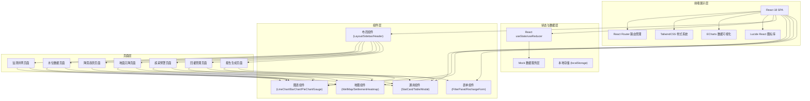
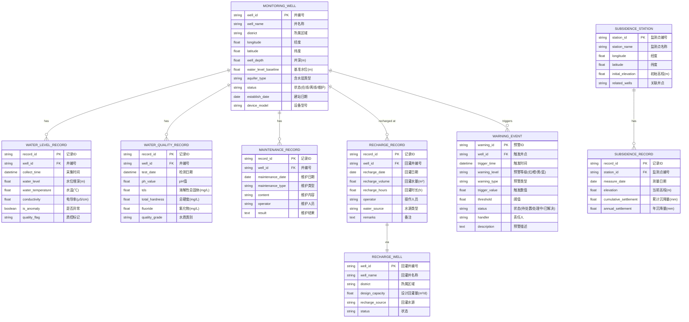

## 1. 架构设计

## 2. 技术描述

- **前端框架**: React@18 + TypeScript@5，函数式组件 + Hooks 开发模式
- **构建工具**: Vite@5，快速开发热更新，优化打包构建
- **路由管理**: React Router DOM@6，SPA 单页应用路由
- **样式方案**: TailwindCSS@3，原子化CSS，PostCSS 预处理
- **图表库**: ECharts@5 + echarts-for-react，专业数据可视化
- **图标库**: Lucide React@0.400，线性图标体系
- **日期处理**: date-fns@3，轻量级日期工具库
- **模拟数据**: 纯前端 Mock 数据，内置在 data/ 目录下的 TypeScript 文件中
- **代码规范**: ESLint + Prettier，统一代码风格

## 3. 路由定义

| 路由路径 | 页面名称 | 页面说明 |
|----------|----------|----------|
| / | 监测井网 | 首页，GIS分布地图、统计概览、井点列表 |
| /water-level | 水位数据 | 实时水位采集、数据表格、水质监测、数据质控、开采量统计 |
| /drawdown-trend | 降深趋势 | 水位降深趋势图、多井对比、季节性分析、年度趋势 |
| /land-subsidence | 地面沉降 | 沉降关联分析、沉降分布、耦合曲线、风险评估 |
| /overdraft-warning | 超采预警 | 超采区分布、预警看板、事件列表、处置流程 |
| /recharge-management | 回灌管理 | 回灌登记、回灌井管理、回灌量统计、效果评估 |
| /report-generation | 报告生成 | 年度通报、历史查询、自定义报表、导出功能 |

## 4. 数据模型

### 4.1 数据模型定义 (ER图)

### 4.2 模拟数据定义

所有数据使用 TypeScript 常量定义，存储在 `src/data/` 目录下：

- `wells.ts` - 监测井基础数据（50+井点）
- `waterLevel.ts` - 水位采集记录（按天生成，覆盖近3年）
- `waterQuality.ts` - 水质检测记录
- `subsidence.ts` - 沉降监测数据
- `warnings.ts` - 预警事件记录
- `recharge.ts` - 回灌管理数据
- `maintenance.ts` - 设备维护记录

数据生成原则：
- 井点按行政区划均匀分布，包含不同类型（深层承压井、浅层井、观测井）
- 水位数据包含季节性波动、逐年下降趋势、异常突变点
- 预警数据覆盖红/橙/黄/蓝四级，状态分布合理
- 沉降数据与水位降深呈现正相关性
